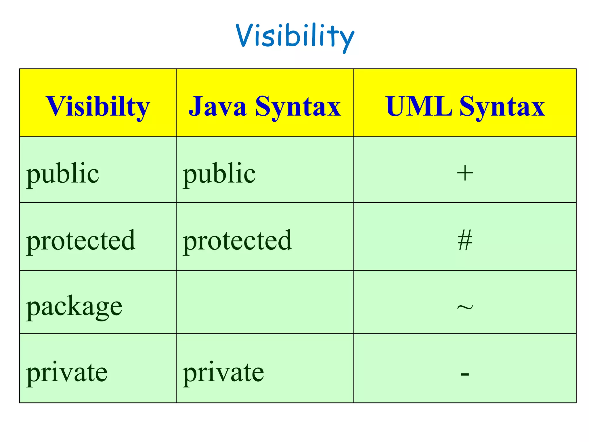
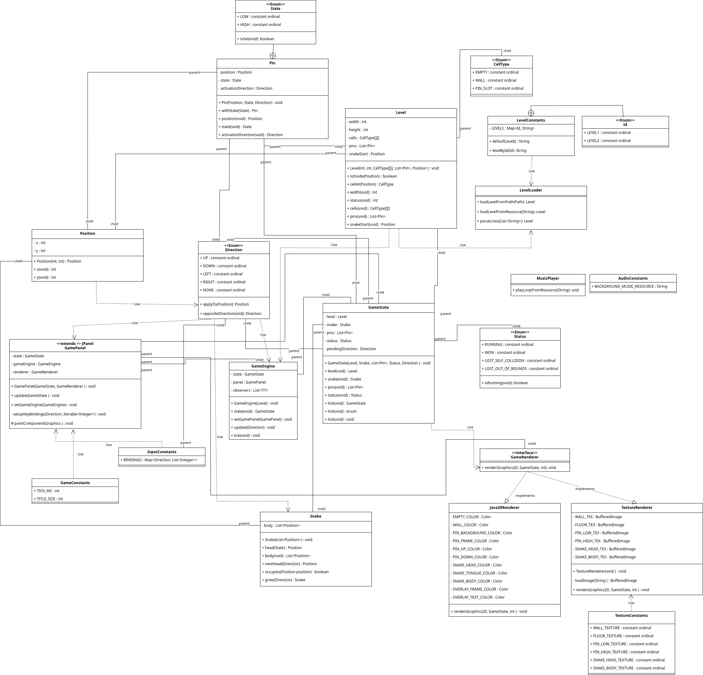

# Blatt03

Relevante Repo / Branch Links:
- Calculator:   https://github.com/4Max0/prog2_ybel_calculator/tree/B03
- LockSnake:    https://github.com/4Max0/prog2_ybel_locksnake/tree/B03

## Aufgabe: LockSnake
### UML

Die visibility wurde mit folgenden Zeichen definiert: 

Das UML Klassendiagramm wurde mit [draw.io](https://www.drawio.com) erstellst.

Die Associations und Dependencies sind darauf abgebildet.